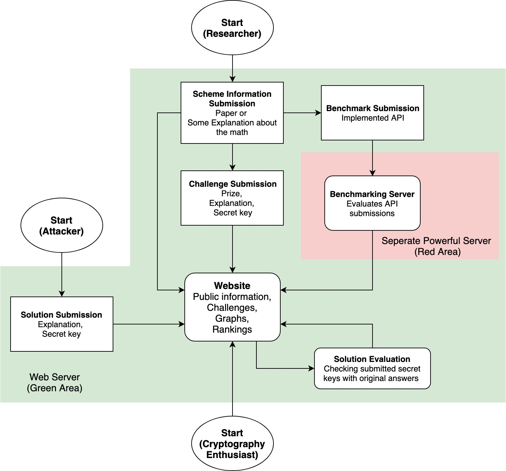

# Obfuscation Wars
## Creating Incentives Towards Crowdsourcing Cryptanalysis of State-of-the-art Academic Cryptosystems

Many researchers are coming up with cryptosystems, but no one is really trying to break them. Can we develop an ecosystem crowdsourcing this? If you think your cryptosystem is secure enough, you put money on it. The more you put, the more you trust. Is this working? History taught us yes, the [RSA Factoring challenge](https://en.wikipedia.org/wiki/RSA_Factoring_Challenge). By creating a web platform that researchers can submit various challenges based on their cryptosystems and schemes, we can let cryptography enthusiasts all around the world try to break them. As a result, we can create an objective security & performance ranking for state-of-the-art academic cryptosystems based on the crowdsourced attempts to break challenges, which are incentivized by monetary prizes.

The web site automatically evaluates the submitted scheme and measures the speed once uploaded to the web site. Meanwhile, cryptography enthusiasts can download and try to break automatically generated challenges based on the submitted fully homomorphic encryption schemes. 

The system consists of two parts: website and backend server. The website runs on a public web server that anybody can reach with a computer. The backend server does all evaluations and sends data back to the public web server. The backend server utilizes the [Encrypt-Everything-Everywhere (E3)](https://github.com/momalab/e3) homomorphic encryption framework to perform benchmarks.

Here, workflow of the system is explained with a scheme:

### Minimum system requirements

Hardware:

	* Single core cpu

	* 512mb ram

Software:

	Generic:

		* Ubuntu 18.04 (16.04 also works if 18.04 is not possible)

		* SSH access (root if possible)

		* FTP access

		* git >=2.17.1

		* UnZip >=6.0.0

		* perl 5 >=26

		* Wget >=1.19.4

	For Website:

		* SSL certificate (Not required but highly recommended if possible)

		* Apache >=2.4.29

			Apache rewrite module enabled

		* PHP >= 7.1.3

			BCMath PHP Extension

			Ctype PHP Extension

			JSON PHP Extension

			Mbstring PHP Extension

			OpenSSL PHP Extension

			PDO PHP Extension

			Tokenizer PHP Extension

			XML PHP Extension

			PHP Zip Extension

			php-mysql Extension

		* Composer >=1.8.6

		* mariadb-server >=10.2.25

			Configured to allow remote access from specific IP addresses

		* Any SMTP email server software (Account registration, email verification, etc)

			Configured for both sending and receiving emails

	For Benchmarking Script:

		* GCC >=7.4.0

		* Make >=4.1

		* Python >=3.6

		* python3-pip >=9.0.1

			mysql-connector-python >=8.0.17
